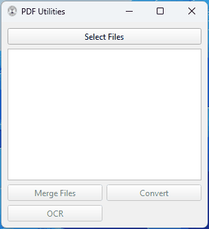

### Development Environment Used

Windows 11

Python 3.12

### Software Requiredments

[Ghostscript](https://ghostscript.com/releases/gsdnld.html)

[tesseract v5.4.X](https://github.com/UB-Mannheim/tesseract/releases/download/v5.4.0.20240606/tesseract-ocr-w64-setup-5.4.0.20240606.exe)


**For python dependencies**

```bash
pip install -r requirements.txt
```

### Demo



---

### ocrmypdf command

```bash
ocrmypdf --rotate-pages --output-type pdf --force-ocr -l eng+hin <inpfile_name> <outfile_name>
```
